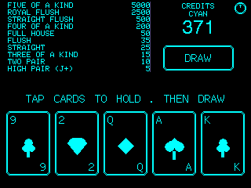

# xXCYD-PokerXx

Two poker games for the ESP32-32E (1-USB) and 2USB CYD (Cheap Yellow Display) — classic 5-Card Draw Joker Poker and heads-up Texas Hold'em against xXSmokeXx (AI).

[](https://www.patreon.com/c/xXQuantumSmokeXx)

## Version 1.1.0

Universal 2-USB compatibility release — calibration system ported from [xXCYD-WeatherXx](https://github.com/xXQuantumSmokeXx/xXCYD-Weather-StationXx) v1.1.8.

**2USB firmware uses LovyanGFX** to auto-detect the display controller (ILI9341 or ST7789) at boot. A single `CYD-Poker-2usb.bin` covers all 2USB hardware revisions. On first boot, interactive calibration screens let you match your panel's display and touch orientation — identical to the CYD-Weather calibration flow.

## Screens

| Video Poker | Texas Hold'em |
|-------------|---------------|
|  |  |

### Features

**Video Poker (5-Card Draw):**
- Classic Joker Poker with one wild joker — 10 hand rankings up to Five of a Kind
- Tap cards to hold, draw to replace, gamble/double feature on wins
- Paytable displayed on-screen with all 10 payouts
- Auto-hold strategy on the initial deal

**Texas Hold'em:**
- Heads-up against xXSmokeXx AI with fixed blinds (2/5)
- Full betting rounds: pre-flop → flop → turn → river
- Fold, Check/Call, and Raise actions with side buttons
- AI evaluates hand strength and occasionally bluffs
- Rotating AI status messages ("Rigging Algorithms...", "Consulting the void...", etc.)
- Persistent chip stacks — survive power cycles and game mode switches

**General:**
- 9 theme accent colors (CYAN, GREEN, RED, ORANGE, YELLOW, GRAY, PURPLE, PINK, WHITE) — saved to NVS
- Credit persistence — score survives power cycles and deep sleep
- Tap theme name in the credits panel to cycle themes
- Power button (top-right) — tap for deep sleep, touch screen to wake
- RESET button in Hold'em — reset all scores to defaults
- Mode toggle button switches between Video Poker and Texas Hold'em
- Serial screenshot capture via RGB332 protocol (compatible with xXCYD-ScreenCaptureXx)
- Custom geometric card art — all drawn with TFT_eSPI/LovyanGFX primitives, no bitmaps

### Setup

| Board | Firmware File |
|-------|--------------|
| **ESP32-32E** (1-USB) | `CYD-Poker-1usb.bin` |
| **2USB** (all variants) | `CYD-Poker-2usb.bin` |

These are **merged flash images** — bootloader + partition table + application firmware combined into a single file. Flash at offset `0x00` with any ESP32 tool (esptool, ESP32 Flash Download Tool, BinForge, etc.).

**Direct flash:**
```bash
esptool.py --chip esp32 write_flash 0x0 CYD-Poker-1usb.bin
esptool.py --chip esp32 write_flash 0x0 CYD-Poker-2usb.bin
```

**Or via M5Launcher:** copy the `.bin` file onto a micro SD card (FAT32), insert into your CYD, launch [M5Launcher](https://github.com/bmorcelli/M5Launcher), select the firmware, and flash.

### First Boot (2USB)

On first boot, two calibration screens appear:

1. **Display calibration** — an asymmetric reference pattern (amber triangle, colored bracket, ring, crosshair, "T"). Tap to cycle through 8 display rotations. When the pattern looks correct, hold 2 seconds to confirm.

2. **Touch calibration** — corner crosshair targets with a live amber cursor that follows your finger. Tap to cycle through 4 touch-digitizer rotations. When the cursor accurately follows your finger, hold 2 seconds to confirm.

Calibration runs once and persists in NVS. To re-run it, send `M` (display) or `T` (touch) via serial, or clear NVS.

### Build

Build from source with PlatformIO:

```bash
# ESP32-32E (1-USB)
pio run --environment cyd_poker

# 2USB (all variants — LovyanGFX auto-detect)
pio run --environment cyd_poker_2usb
```

After a successful build, merged flashable images (`CYD-Poker-1usb.bin` / `CYD-Poker-2usb.bin`) are auto-generated at the project root.

### Credits

Originally inspired by [Jolly-Card-Poker-CYD](https://github.com/dzulidzan/Jolly-Card-Poker-CYD) by dzulidzan. Completely rewritten with custom card art, theming, and Texas Hold'em mode.

Calibration system ported from [xXCYD-WeatherXx](https://github.com/xXQuantumSmokeXx/xXCYD-Weather-StationXx).

Built by xXQuantum-SmokeXx, with development assistance from Claude Code.
