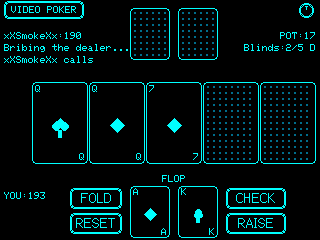

# xXCYD-PokerXx

Two poker games for the **Cheap Yellow Display (CYD)** — ESP32 + ILI9341 touchscreen.

## Games

### Video Poker (5-Card Draw)
Classic Joker Poker — 5-card draw with a wild joker. Hold/draw mechanics, gamble/double feature, and 10 hand rankings up to Five of a Kind.

### Texas Hold'em
Heads-up against **xXSmokeXx** (AI). Fixed blinds, full betting rounds (pre-flop → flop → turn → river), fold/check-call/raise actions. The AI evaluates hand strength and occasionally bluffs. Persistent chip stacks.

## Features
- **9 themes** (CYAN, GREEN, RED, ORANGE, YELLOW, GRAY, PURPLE, PINK, WHITE) — saved to NVS
- **Credit persistence** — score survives power cycles
- **Deep sleep** — tap power button to sleep, touch screen to wake
- **Serial screenshot capture** — RGB332 protocol (compatible with xXCYD-ScreenCaptureXx)
- **Custom geometric card art** — no bitmaps, all drawn with TFT_eSPI primitives

## Hardware
- ESP32 (Cheap Yellow Display)
- ILI9341 240×320 TFT (landscape)
- XPT2046 touch controller

## Build
PlatformIO project. Same pinout as CYD-Weather.

```bash
pio run
pio run --target upload
```

## Screenshots

### Video Poker


### Texas Hold'em


## Credits
Built on the CYD-Weather foundation by xXMayDayXx / xXQuantumSmokeXx.
